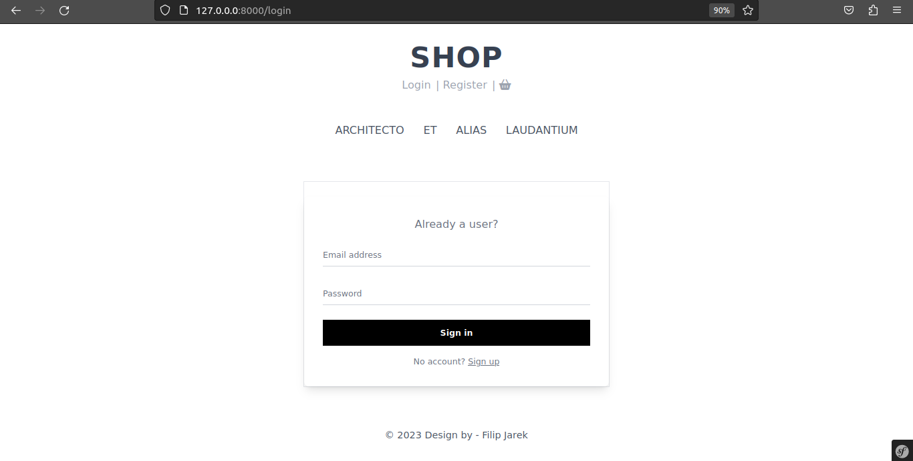
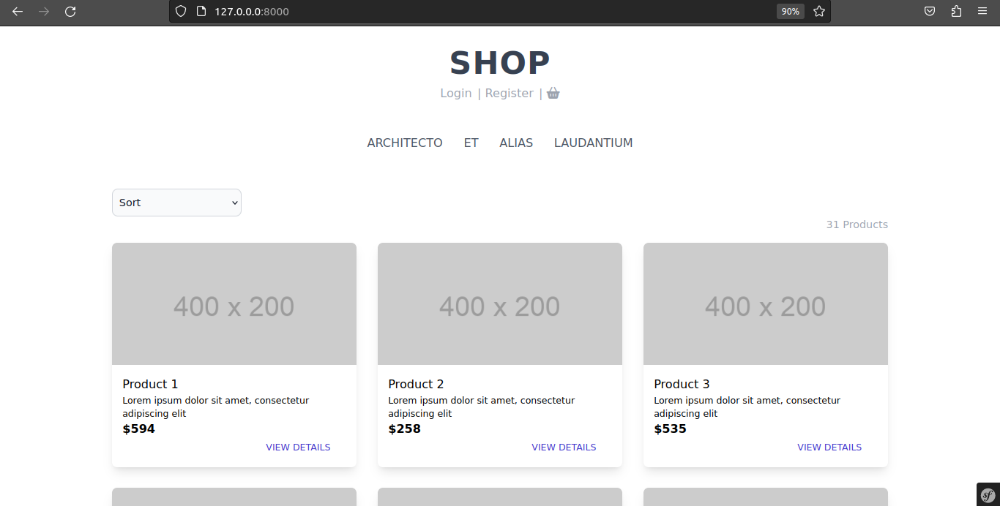

# shop

## Table of Contents
* [Technologies Used](#technologies-used)
* [Features](#features)
* [Screenshots](#screenshots)
* [Setup](#setup)
* [Testing](#testing)

## Technologies Used

    Symfony 6.1.12
    PHP 8.1.17
    TailwindCSS 3.2.7
    Easycorp/easyadmin-bundle 4.6.1
    Fakerphp/faker 1.21.0
    Phpunit/phpunit 9.6.6
    
## Features

## Screenshots



## Setup
#### Step 1 : Clone the project
```
$ git clone https://github.com/filipjarek/shop
```
#### Step 2 : Change current directory
```
$ cd shop
```
#### Step 3 : Configuration
```
Set the database (mysql) in .env file db_name, db_username and db_password.
```
#### Step 4 : Install dependencies
```
$ composer install
$ npm install
$ npm run build
```
#### Step 5 : Setup database
```
$ php bin/console doctrine:database:create
$ php bin/console make:migration
$ php bin/console doctrine:fixtures:load
```
#### Step 6 : Run the project
```
$ symfony serve -d
```
Open link in your browser: http://localhost:8000:

#### Admin credentails
```
e-mail: admin@gmail.com
password: password
```
## Testing
```
$ ./vendor/phpunit/phpunit/phpunit
$ php bin/phpunit
```
Run the tests using PHPUnit package
